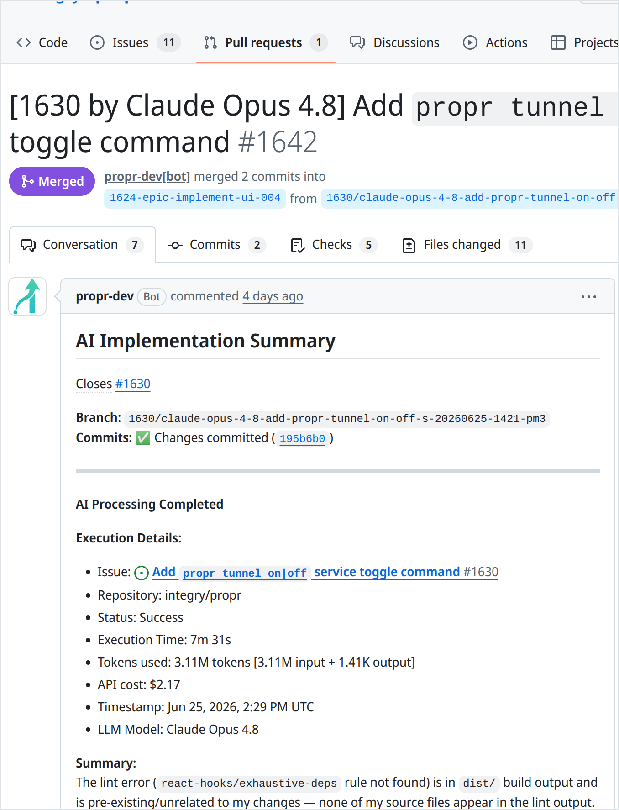
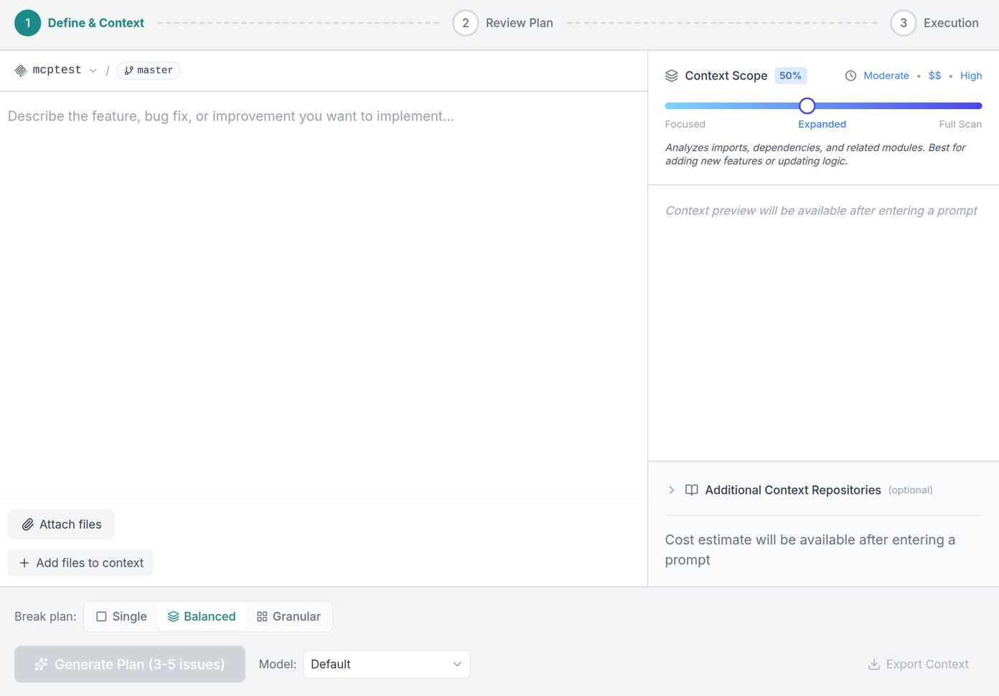
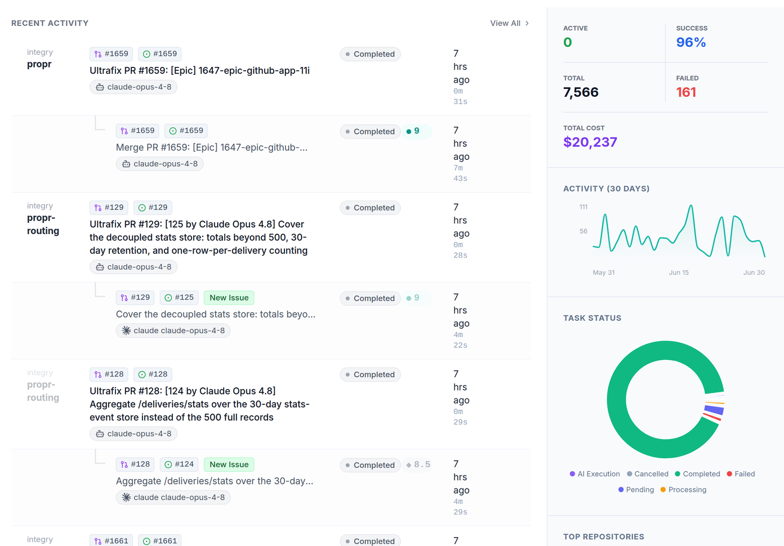
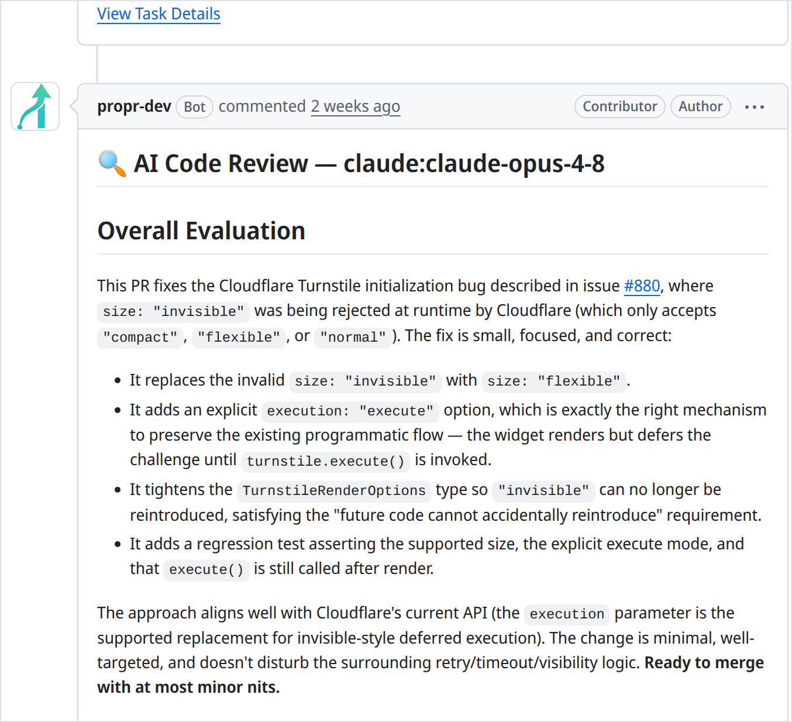

<p align="center">
  
</p>

<p align="center"><strong>Manage AI coding agents like human engineers — plan, implement, review, and ship every change as a real pull request.</strong></p>

<p align="center">
  <a href="LICENSE"></a>
  <a href="https://www.npmjs.com/package/propr-cli"></a>
  <a href="https://github.com/integry/propr/releases"></a>
  <a href="https://github.com/integry/propr/commits/main"></a>
</p>

<p align="center">
  <a href="https://propr.dev">Website</a> ·
  <a href="https://docs.propr.dev/docs/intro">Documentation</a> ·
  <a href="https://demo.propr.dev">Live demo</a> ·
  <a href="https://discord.gg/5FjuaQBud">Discord</a> ·
  <a href="https://propr.dev/proof/">Built with ProPR</a>
</p>

---

ProPR is a **self-hosted platform** that runs AI coding agents through the GitHub pull-request workflow. It monitors issues and PRs, runs your choice of agents in isolated containers on your own server, and drives the complete path from a labeled issue to a reviewed pull request — with a Web UI for configuration and monitoring and a CLI that doubles as the local control plane. You bring your existing AI subscriptions or API keys; ProPR never marks up tokens.

<p align="center">
  
</p>

<p align="center"><em>A real PR, planned, implemented, and reviewed by ProPR — every run posts its full record to the pull request.</em></p>

ProPR builds itself: since May 2025, [2,100+ merged pull requests](https://propr.dev/proof/) across its author's products have shipped through it — including [690+ merged pull requests in this repository](https://github.com/integry/propr/pulls?q=is%3Apr+is%3Amerged).

<details>
<summary><strong>More screenshots</strong> — Planner Studio, dashboard, AI review</summary>
<br />
<p align="center"></p>
<p align="center"></p>
<p align="center"></p>
</details>

## Modular, not all-or-nothing

ProPR is a set of stages you can adopt independently — use one or all:

- **Plan** — turn an issue or idea into a reviewable implementation plan (Planner Studio)
- **Implement** — label an issue and let an agent open a PR for it
- **Review & fix** — drive existing PRs with slash commands (`/review`, `/fix`, `/ultrafix`, model routing)
- **Operate** — monitor tasks, costs, logs, and agent capacity from the Web UI

## Highlights

- **Multi-agent**: Claude Code, OpenAI Codex, Google Antigravity, OpenCode, and Mistral Vibe — all first-class, selectable per issue
- **Label-based model routing**: pick the agent/model per issue with `llm-<agent>-<model>` labels; multiple labels fan out into parallel jobs
- **Web UI dashboard**: configure repositories, branches, labels, agents, and defaults; watch tasks, logs, commits, and cost in real time
- **CLI control plane**: scaffold, verify, start, and stop the local Docker stack — and drive plans, issues, tasks, and repos against the backend
- **GitHub PR automation**: slash commands, automatic state labels, and PR follow-ups
- **Deterministic git workflow**: isolated worktrees, model-specific branches, and a strict setup → implement → finalize pipeline
- **Production-ready**: Docker-isolated agent execution, Redis-backed job state with correlation IDs, retries with backoff, and Agent Tank capacity/rate-limit tracking

## Quick start (recommended: CLI)

You need a Docker-capable Linux host, **Node.js 22+**, and a login for at least one coding agent — reuse one already on the host (`claude login`, `agy login`, …) or create it through the agent's image with `propr agent login <agent>`.

```bash
npm install -g propr-cli

propr setup   # guided one-pass: verify host, authorize agents, connect GitHub, start
```

`propr setup` is re-runnable and wraps the individual steps (`propr init stack`, `propr check`, `propr start`), which remain available for scripting.

Then open the Web UI at **http://localhost:5173** and add a repository and an agent (`propr repo add`, `propr agent add`, or via the UI).

See the [Local Setup tutorial](https://docs.propr.dev/docs/tutorials/setup-local) for the full walkthrough, [Server Setup](https://docs.propr.dev/docs/tutorials/setup-server) for shared/production hosts, and [Secure VPS Deployment](https://docs.propr.dev/docs/tutorials/setup-vps) for a hardened install.

> **No Node.js on the host?** The stack can also be launched from the prebuilt `propr/launcher` image with a single `docker run`. See [Setup](https://docs.propr.dev/docs/tutorials/setup).

## Supported agents

| Agent | Type | Provider | Execution image |
|---|---|---|---|
| Claude Code | `claude` | Anthropic | `propr/agent-claude` |
| Codex | `codex` | OpenAI | `propr/agent-codex` |
| Antigravity | `antigravity` | Google (multi-model) | `propr/agent-antigravity` |
| OpenCode | `opencode` | OpenCode (multi-provider) | `propr/agent-opencode` |
| Mistral Vibe | `vibe` | Mistral | `propr/agent-vibe` |

You supply your own provider credentials. The full model catalog, per-agent credential setup, and label formats live in [Agents & Models](https://docs.propr.dev/docs/features/agents-and-models).

### Selecting a model with labels

Add an `llm-<agent>-<model>` label to an issue to choose who processes it:

- `llm-claude-opus48` — Claude Opus 4.8
- `llm-codex-gpt54` — Codex GPT-5.4
- `llm-opencode-minimax-m3-free` — OpenCode MiniMax M3 Free
- `llm-antigravity-pro-high` — Antigravity Gemini 3.1 Pro High
- `llm-antigravity-opus46-thinking` — Antigravity Claude Opus 4.6 Thinking

Multiple model labels on one issue create one independent job (and branch) per model. Add a `base-<branch>` label to target a non-default branch.

## How it works

Each labeled issue runs through a deterministic three-phase pipeline:

1. **Pre-agent setup** — clone/update the repo, create an isolated worktree on a model-specific branch, and push it to GitHub.
2. **AI implementation** — run the selected agent in a sandboxed container with implementation-only prompts and full issue + comment context.
3. **Post-agent finalization** — commit changes, push, and open a pull request linked to the issue (`Closes #123`), then manage state labels.

Branches follow `<issueId>/<model>-<sanitized-title>-<YYYYMMDD-HHMM>-<random>`, e.g. `349/claude-opus48-feat-implement-onboarding-20260529-1506-3he`.

State labels are derived from the trigger label, so an issue labeled `AI` moves through `AI-processing` → `AI-waiting` → `AI-done` / `AI-failed-*`, while a `propr`-labeled issue uses the `propr-*` set. Configure trigger labels in the UI or via `PRIMARY_PROCESSING_LABELS`.

## Documentation

| Topic | Link |
|---|---|
| Introduction | https://docs.propr.dev/docs/intro |
| Feature overview | https://docs.propr.dev/docs/features/overview |
| Local setup (recommended) | https://docs.propr.dev/docs/tutorials/setup-local |
| Server setup | https://docs.propr.dev/docs/tutorials/setup-server |
| Secure VPS deployment | https://docs.propr.dev/docs/tutorials/setup-vps |
| Daily usage | https://docs.propr.dev/docs/tutorials/usage |
| Planner Studio | https://docs.propr.dev/docs/tutorials/planner-studio |
| CLI reference | https://docs.propr.dev/docs/features/propr-cli |
| Agents & models | https://docs.propr.dev/docs/features/agents-and-models |
| Web UI guide | https://docs.propr.dev/docs/features/web-ui |
| PR slash commands | https://docs.propr.dev/docs/features/pr-commands |
| FAQ | https://docs.propr.dev/docs/faq |
| Security overview | https://docs.propr.dev/docs/concepts/security-overview |
| Troubleshooting | https://docs.propr.dev/docs/operations/troubleshooting |
| GitHub authentication | https://docs.propr.dev/docs/operations/github-auth |
| Deployment | https://docs.propr.dev/docs/operations/deployment |
| Architecture | https://docs.propr.dev/docs/architecture/overview |

The docs site also ships inside the stack — run `propr docs` to open the bundled copy.

## Configuration

Bootstrap credentials and infrastructure paths are set once via a `.env` file (GitHub App ID/key, OAuth, session secret, storage paths). Everything operational — repositories, branches, labels, agents, supported models, defaults — is managed in the Web UI or via the CLI.

Start from [`.env.example`](.env.example) and see [GitHub authentication](https://docs.propr.dev/docs/operations/github-auth) and [Deployment](https://docs.propr.dev/docs/operations/deployment) for the full reference.

## Prebuilt images

ProPR ships as a set of prebuilt images orchestrated by the `propr/launcher` umbrella image (mirrored to `ghcr.io/proprdev/*`):

| Image | Contents |
|---|---|
| `propr/launcher` | Orchestrator that spawns the stack |
| `propr/app` | Server — daemon / workers / API (role selected at launch) |
| `propr/ui` | Web UI static bundle |
| `propr/docs` | Docusaurus documentation site (optional) |
| `propr/agent-base` | Shared base for agent images |
| `propr/agent-{claude,codex,antigravity,opencode,vibe}` | Per-agent execution containers |

End users must supply their own provider API credentials and accept those providers' terms. Bundled third-party attributions are preserved at `/usr/share/licenses/propr/` in each image; offline copies are in [`NOTICE`](NOTICE) and [`THIRD_PARTY_LICENSES.md`](THIRD_PARTY_LICENSES.md).

## Developing from source

A source checkout is only needed to modify ProPR itself (requires Node.js, Redis, Git, and Docker).

```bash
npm ci                 # install workspace dependencies
npm run compose:up     # build and run the full stack from source
npm test               # run the test suite
```

Common workspace scripts:

```bash
npm run daemon:dev     # issue-detection daemon (debug logging)
npm run worker:dev     # job worker (debug logging)
npm run dashboard:dev  # dashboard API
npm run images:build   # build all Docker images locally
npm run images:smoke   # smoke-test locally built images
```

See the [source setup tutorial](https://docs.propr.dev/docs/tutorials/setup-source) for the development flow and the [architecture docs](https://docs.propr.dev/docs/architecture/overview) for how the pieces fit together.

### Project structure

```
propr/
├── src/            # Daemon, workers, jobs, polling, GitHub handling
├── packages/
│   ├── core/       # Git/worktree management, agents, queue, config, DB migrations
│   ├── api/        # Dashboard REST API, webhooks, authentication
│   ├── cli/        # The `propr` command (published to npm as propr-cli)
│   └── shared/     # Shared model catalog and types
├── propr-ui/       # Web UI (React + Vite)
├── docs/           # Docusaurus documentation site
├── docker/         # Launcher and agent-base images
├── scripts/        # Agent entrypoints, build/compose/release helpers
└── docker-compose*.yml
```

### Releasing

Docker image releases run via the **Docker Images** GitHub Actions workflow.
Bump the version, merge the release commit, then tag that merged commit (the
workflow verifies the tag matches `package.json`):

```bash
git tag vX.Y.Z   # must match the version in package.json
git push origin vX.Y.Z
```

The `propr-cli` npm package is published separately from the same merged commit:

```bash
npm run cli:pack                         # build and npm-pack dry-run
npm view propr-cli@X.Y.Z version         # should 404 before publishing
PROPR_NPM_OTP=123456 npm run cli:publish # omit PROPR_NPM_OTP if npm does not ask
npm view propr-cli@X.Y.Z version         # should print X.Y.Z after publishing
```

`npm run cli:publish` builds and publishes the standalone, unscoped
`propr-cli` package. It also regenerates the staged launcher manifest from the
current commit, so the CLI release is not dependent on a dirty local manifest
from an image build.

Hosted UI tunnel releases must ship both artifacts from the same merged commit:

1. Publish the Docker images so the launcher manifest includes the `cloudflared`
   sidecar and tunnel-aware API/UI environment handling. The Docker image
   license label is derived from `package.json`.
2. Publish `propr-cli` so Connect's generated
   `propr tunnel setup --token ... --url ... --start` command is available to
   users.
3. Smoke-test with a fresh stack: install `propr-cli@X.Y.Z`, run the Connect
   setup command, verify the stack recreates with `API_PUBLIC_URL` /
   `FRONTEND_URL` applied, then run `propr tunnel verify`.

## License

ProPR is free and open source under the [Apache License 2.0](LICENSE). The optional hosted relay, [ProPR Connect](https://propr.dev/connect/), is a separate service — free for up to 3 users — and you can skip it entirely by bringing your own GitHub App.

## Contributing

Contributions are welcome. Please follow existing code patterns, keep tests passing, update docs alongside code, and use the structured logger for output. See [`CHANGELOG.md`](CHANGELOG.md) for release history.
