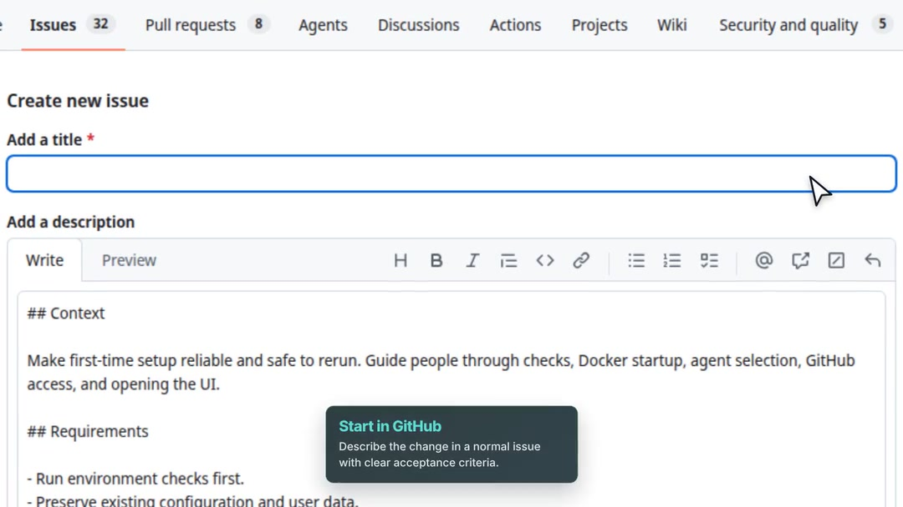
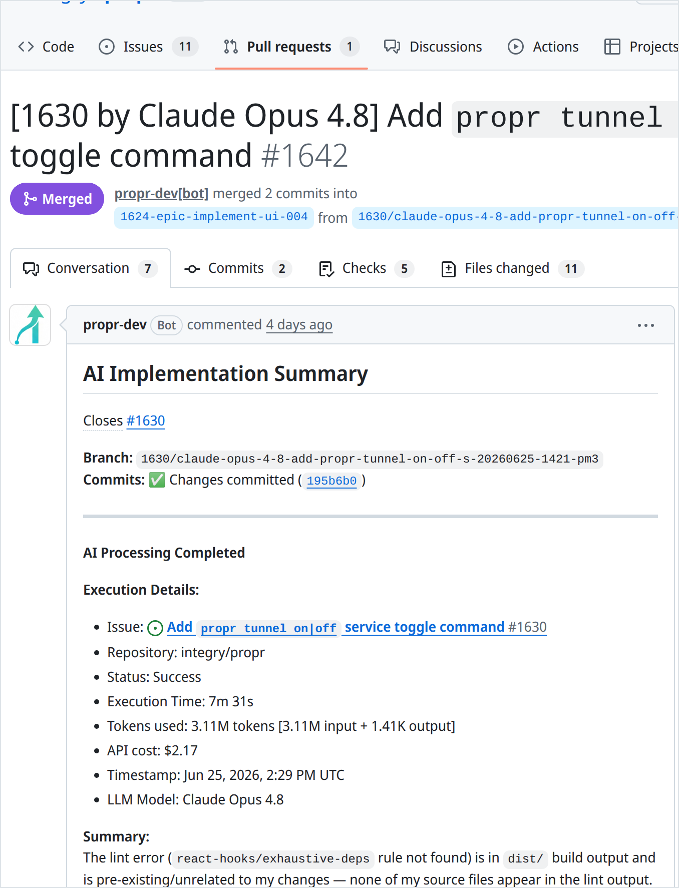
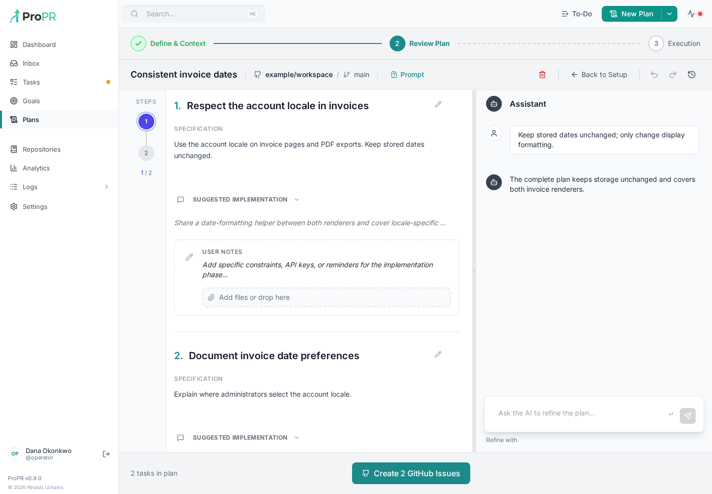
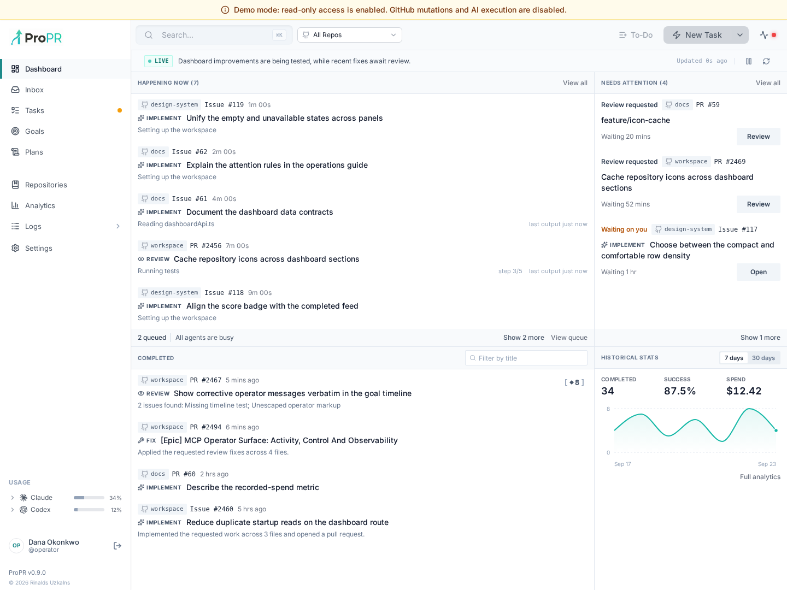
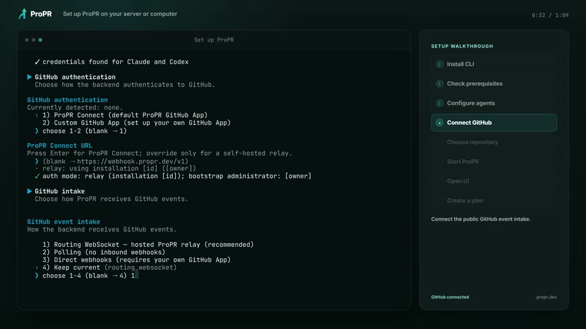

<p align="center">
  
</p>

<h1 align="center">GitHub orchestration for AI coding agents</h1>

<p align="center">
  Run Claude Code, Codex and other coding agents on your own server.<br />
  Every task runs in an isolated workspace and lands as a pull request you refine in GitHub.
</p>

<p align="center">
  <a href="#quickstart"><strong>Quickstart</strong></a> ·
  <a href="https://docs.propr.dev/docs/intro"><strong>Docs</strong></a> ·
  <a href="https://demo.propr.dev"><strong>Live demo</strong></a> ·
  <a href="https://propr.dev"><strong>Website</strong></a> ·
  <a href="https://discord.gg/5FjuaQBud"><strong>Discord</strong></a> ·
  <a href="https://propr.dev/proof/"><strong>Built with ProPR</strong></a>
</p>

<p align="center">
  <a href="LICENSE"></a>
  <a href="https://www.npmjs.com/package/propr-cli"></a>
  <a href="https://github.com/integry/propr/releases"></a>
  <a href="https://github.com/integry/propr/commits/main"></a>
  <a href="https://discord.gg/5FjuaQBud"></a>
</p>

<br />

<!--
  Hero video. GitHub only renders an inline player for videos uploaded through its web editor.
  Upload github-orchestration-loop.mp4, then replace the linked poster below with:
  <div align="center"><video src="https://github.com/user-attachments/assets/..." width="720" controls></video></div>
-->
<p align="center">
  <a href="https://propr.dev/assets/videos/github-orchestration-loop.mp4">
    
  </a>
</p>

<p align="center">
  <em>▶ Watch the 68-second demo — from a labeled GitHub issue to a reviewed, merged pull request.</em>
</p>

<p align="center">
  <a href="#quickstart"><strong>Install in two commands →</strong></a>
  &nbsp;&nbsp;·&nbsp;&nbsp;
  <a href="https://demo.propr.dev"><strong>Explore the live demo →</strong></a>
</p>

<br />

## What is ProPR?

ProPR is an **open-source, self-hosted platform** that manages AI coding agents the way you manage engineers: through issues, pull requests and code review. Claude Code, Codex and other agents write the code. ProPR gives them a shared engineering process — a plan, an isolated workspace, a pull request, and a review loop — on your own server, with the AI subscriptions or API keys you already have.

**Label a GitHub issue and get a pull request back.**

|        | Step                        | What happens                                                                                             |
| ------ | --------------------------- | -------------------------------------------------------------------------------------------------------- |
| **01** | Label an issue              | Add the `AI` label to a normal GitHub issue. Add a model label such as `llm-claude-opus55` to pick the agent. |
| **02** | Get a pull request          | The agent works in its own Docker container and Git worktree, then ProPR opens a PR with the diff and a run summary: status, duration, token cost and model. Full prompts and logs stay in the ProPR Web UI. |
| **03** | Review, refine and merge    | Leave ordinary review comments or use `/review`, `/fix` and `/ultrafix`. The agent pushes follow-up commits. You make the merge decision. |

<br />

<p align="center">
  <strong>Works with</strong><br />
  <a href="https://docs.propr.dev/docs/features/agents-and-models">Claude Code</a> ·
  <a href="https://docs.propr.dev/docs/features/agents-and-models">OpenAI Codex</a> ·
  <a href="https://docs.propr.dev/docs/features/agents-and-models">Google Antigravity</a> ·
  <a href="https://docs.propr.dev/docs/features/agents-and-models">OpenCode</a> ·
  <a href="https://docs.propr.dev/docs/features/agents-and-models">Mistral Vibe</a>
</p>

<p align="center"><em>Bring your own subscription or API key. ProPR never marks up tokens.</em></p>

<br />

## ProPR is right for you if

- ✅ You want AI-written code to arrive as **reviewable pull requests**, not terminal scrollback
- ✅ You run **several agent sessions at once** and lose track of what each one is doing
- ✅ You want to use the **Claude, ChatGPT or other subscriptions you already pay for**
- ✅ You want repositories, logs and credentials to **stay on your own server**
- ✅ You want to **mix agents** — implement with one, review with another, fix with a third
- ✅ You want to delegate a task, **walk away, and review the PR** when it is ready
- ✅ You want to see **what every run cost** and what it did

<br />

## Features

<table>
<tr>
<td align="center" width="33%" valign="top">
<h3>🏷️ Issue to pull request</h3>
Label a GitHub issue and an agent implements it, then opens a PR linked back to the issue. State labels track progress automatically.
</td>
<td align="center" width="33%" valign="top">
<h3>🗺️ Planner Studio</h3>
Turn an idea into review-sized tasks with acceptance criteria. <a href="https://docs.propr.dev/docs/tutorials/planner-studio">Refine the plan in chat</a>, then create the GitHub issues.
</td>
<td align="center" width="33%" valign="top">
<h3>🔍 AI code review</h3>
Comment <code>/review</code> on any PR for severity-grouped findings and a score. <a href="https://docs.propr.dev/docs/features/pr-commands">Apply them with <code>/fix</code></a>.
</td>
</tr>
<tr>
<td align="center" valign="top">
<h3>🔁 Ultrafix</h3>
An automated review, repair and re-review loop that runs until the PR reaches the score you set, then hands it back for a human merge.
</td>
<td align="center" valign="top">
<h3>🤖 Bring your own agent</h3>
<a href="https://docs.propr.dev/docs/features/agents-and-models">Five agents, selectable per issue</a>. Several model labels on one issue produce separate PRs to compare.
</td>
<td align="center" valign="top">
<h3>📦 Isolated execution</h3>
Every run gets its own branch, Git worktree and Docker container, so <a href="https://docs.propr.dev/docs/features/execution-safety">parallel agents never collide</a> with each other or your checkout.
</td>
</tr>
<tr>
<td align="center" valign="top">
<h3>🎯 Tasks and goals</h3>
Start a single instruction, or <a href="https://docs.propr.dev/docs/features/goals">steer a long-running agent session</a> with corrections while it works.
</td>
<td align="center" valign="top">
<h3>💰 Run record and cost</h3>
Each task keeps its prompts, streamed logs, commits and per-call model cost. <a href="https://docs.propr.dev/docs/features/web-ui">Watch it all in the Web UI</a>.
</td>
<td align="center" valign="top">
<h3>💬 Control from chat</h3>
Connect a chat client over <a href="https://docs.propr.dev/docs/features/mcp">authenticated MCP</a> to plan issues, check what is running, send a correction or request a merge.
</td>
</tr>
<tr>
<td align="center" valign="top">
<h3>📥 Inbox and push</h3>
<a href="https://docs.propr.dev/docs/features/inbox">Follow work</a> across browser, installed PWA and desktop, with notification controls per person and per repository.
</td>
<td align="center" valign="top">
<h3>⌨️ CLI control plane</h3>
<a href="https://docs.propr.dev/docs/features/propr-cli">One command</a> sets up, verifies, starts and stops the stack, and drives plans, tasks and repositories.
</td>
<td align="center" valign="top">
<h3>🧩 Sequenced delivery</h3>
Epic mode runs a multi-issue plan in order. Each PR merges before the next implementation starts, so a large change ships as reviewable diffs.
</td>
</tr>
</table>

**Adopt one stage or all of them.** Plan, implement, review and operate are independent — use ProPR only to review existing PRs, only to plan, or for the whole path.

<br />

## Problems ProPR solves

| Without ProPR | With ProPR |
| --- | --- |
| ❌ Agent output lives in terminal scrollback and chat history that nobody else can review. | ✅ Every change is a pull request with the diff, run summary and discussion in GitHub. Full prompts and logs are in the ProPR Web UI on your server. |
| ❌ You sit in a terminal approving commands and edits one at a time. | ✅ Approval moves to the pull request. Label the issue, walk away, review the result. |
| ❌ Parallel agent sessions step on each other's files and branches. | ✅ Each run has its own branch, worktree and container. |
| ❌ A hosted agent service needs your code on its servers and bills tokens at its own rates. | ✅ ProPR runs on your server with your own subscriptions or API keys, at no markup. |
| ❌ The agent that wrote the code is also the only one checking it. | ✅ A different agent can review the PR, and Ultrafix repeats review and repair until it passes. |
| ❌ A change too big for one PR becomes one unreviewable diff. | ✅ Planning splits it into review-sized tasks, and Epic mode ships them in order. |

<br />

## We build everything with ProPR

Since May 2025, [2,100+ merged pull requests](https://propr.dev/proof/) across its author's products have shipped through ProPR — including [690+ merged pull requests in this repository](https://github.com/integry/propr/pulls?q=is%3Apr+is%3Amerged). Follow one from start to finish: [issue #1601](https://github.com/integry/propr/issues/1601) → [pull request #1613](https://github.com/integry/propr/pull/1613).

<p align="center">
  
</p>

<p align="center"><em>Every run posts a summary to the pull request. The full prompts and logs stay in the ProPR Web UI.</em></p>

<p align="center">
  
</p>

<p align="center"><em>Planner Studio — shape the plan before any code is written.</em></p>

<p align="center">
  
</p>

<p align="center"><em>The dashboard — what is running, what needs attention, and what it cost.</em></p>

<br />

## Quickstart

Open source. Self-hosted. Free.

```bash
npm install -g propr-cli
propr setup
```

`propr setup` verifies the host, authorizes your agents, connects GitHub and starts the stack. Then open **http://localhost:5173** and add a repository.

<!--
  CLI setup video. Upload propr-cli-setup.mp4 through the GitHub web editor, then replace the linked poster below with:
  <div align="center"><video src="https://github.com/user-attachments/assets/..." width="720" controls></video></div>
-->
<p align="center">
  <a href="https://propr.dev/assets/videos/propr-cli-setup.mp4">
    
  </a>
</p>

<p align="center"><em>▶ Watch the setup walkthrough (69 seconds).</em></p>

**You need:** a Linux `amd64` host with Docker, **Node.js 22 or 24**, GitHub access, and an account with at least one coding-agent provider. Allow 2 vCPU, 4 GB RAM and 20 GB of disk for a single-task evaluation; 8 GB RAM or more for regular use. See the full [system requirements](https://docs.propr.dev/docs/tutorials/setup#system-requirements).

| If you want to… | Go to |
| --- | --- |
| Follow the full local walkthrough | [Local setup](https://docs.propr.dev/docs/tutorials/setup-local) |
| Run it for a team or in production | [Server setup](https://docs.propr.dev/docs/tutorials/setup-server) · [Secure VPS deployment](https://docs.propr.dev/docs/tutorials/setup-vps) |
| Have your coding agent install it | [Safe agent installation prompt](https://docs.propr.dev/docs/tutorials/setup#give-this-to-your-coding-agent) |
| Install without Node.js on the host | [Launch from the `propr/launcher` image](https://docs.propr.dev/docs/tutorials/setup) |
| Use the desktop app (release candidate) | [Desktop guide](apps/desktop/README.md) |
| Look around before installing | [Live demo](https://demo.propr.dev) |

<br />

## How it works

GitHub is the control plane. ProPR is a Docker stack on your server that watches your repositories and runs each task through a deterministic three-phase pipeline:

```
   GitHub issue + label
           │
           ▼
┌─────────────────────┐   ┌─────────────────────┐   ┌─────────────────────┐
│  1. Setup           │   │  2. Implementation  │   │  3. Finalization    │
│  Clone or update,   │──▶│  The selected agent │──▶│  Commit, push and   │
│  create an isolated │   │  runs in a sandboxed│   │  open a PR linked   │
│  worktree + branch  │   │  Docker container   │   │  to the issue       │
└─────────────────────┘   └─────────────────────┘   └─────────────────────┘
                                                               │
           ┌───────────────────────────────────────────────────┘
           ▼
   Pull request  ◀──▶  review comments, /review, /fix, /ultrafix  ──▶  human merge
```

ProPR performs the branch, commit and push operations itself; the agent only writes code. Read more in [how the pieces fit together](https://docs.propr.dev/docs/architecture/overview) and the [security overview](https://docs.propr.dev/docs/concepts/security-overview).

<br />

## ProPR and direct agent sessions

You don't have to choose. Direct agents fit live exploration; ProPR fits planned development that needs a visible task history and GitHub review.

|                              |                                                                                                                                   |
| ---------------------------- | --------------------------------------------------------------------------------------------------------------------------------- |
| **Use a direct agent**       | While you are still thinking through the code: hot-reloading servers, log tailing, tight interaction with a live environment.      |
| **Use ProPR**                | When the change needs a plan, isolated execution and a clean pull request with the diff, run summary and review in GitHub, plus the full prompts and logs in the ProPR Web UI. |

**How does ProPR compare?**
[vs Claude Code](https://propr.dev/compare/claude-code/) ·
[vs Codex](https://propr.dev/compare/codex/) ·
[vs GitHub Copilot](https://propr.dev/compare/github-copilot/) ·
[vs Cursor](https://propr.dev/compare/cursor-background-agents/) ·
[vs Devin](https://propr.dev/compare/devin/) ·
[vs CodeRabbit](https://propr.dev/compare/coderabbit/) ·
[all comparisons](https://propr.dev/compare/)

<br />

## FAQ

<details>
<summary><strong>What does it cost?</strong></summary>
<br />

ProPR is free and open source under Apache 2.0. You pay your AI provider directly, through a subscription you already have (such as Claude Pro or ChatGPT Plus) or a metered API key. ProPR never marks up tokens. The optional hosted relay, [ProPR Connect](https://propr.dev/connect/), is free for up to 3 users, and you can skip it by bringing your own GitHub App.

</details>

<details>
<summary><strong>Where does my code go?</strong></summary>
<br />

Agents run on your server. Repositories, task history, logs and credentials stay there. Your code reaches the AI provider you chose, as it would if you ran that agent yourself. See the [security overview](https://docs.propr.dev/docs/concepts/security-overview) for the full data boundary, including the optional Connect relay and MCP gateway.

</details>

<details>
<summary><strong>Is it safe to let agents run on their own?</strong></summary>
<br />

Each task runs away from your main checkout in its own Git worktree, branch and Docker container. Every result comes back as commits on a pull request that people can review, retry, discard, merge or revert. An optional allowlist firewall can restrict outbound access; it is off by default. Details are in [execution safety](https://docs.propr.dev/docs/features/execution-safety).

</details>

<details>
<summary><strong>How is this different from running the agent in my terminal?</strong></summary>
<br />

A terminal session asks you to approve commands and edits as it goes. ProPR delegates that control to the isolated workspace and moves your approval to the pull request. Scope the task well and it works like delegating to another engineer: label the issue, walk away, review the PR.

</details>

<details>
<summary><strong>Can I switch agents during the same change?</strong></summary>
<br />

Yes. A PR can start with one agent, get reviewed by another, and receive a follow-up from a third. The branch, commits and pull request give every agent the same starting point.

</details>

<details>
<summary><strong>Does it work with GitLab or Bitbucket?</strong></summary>
<br />

No. ProPR is built on GitHub pull requests, review comments, status checks and comment commands. See the [roadmap](ROADMAP.md) for current direction.

</details>

More answers in the [full FAQ](https://docs.propr.dev/docs/faq).

<br />

## Documentation

| Start here | Use it | Run it |
| --- | --- | --- |
| [Introduction](https://docs.propr.dev/docs/intro) | [Daily usage](https://docs.propr.dev/docs/tutorials/usage) | [Deployment](https://docs.propr.dev/docs/operations/deployment) |
| [Feature overview](https://docs.propr.dev/docs/features/overview) | [PR slash commands](https://docs.propr.dev/docs/features/pr-commands) | [GitHub authentication](https://docs.propr.dev/docs/operations/github-auth) |
| [Local setup](https://docs.propr.dev/docs/tutorials/setup-local) | [Agents and models](https://docs.propr.dev/docs/features/agents-and-models) | [Troubleshooting](https://docs.propr.dev/docs/operations/troubleshooting) |
| [Planner Studio](https://docs.propr.dev/docs/tutorials/planner-studio) | [CLI reference](https://docs.propr.dev/docs/features/propr-cli) | [Architecture](https://docs.propr.dev/docs/architecture/overview) |

The docs also ship inside the stack — run `propr docs` to open the bundled copy.

<br />

## Development

A source checkout is only needed to change ProPR itself.

```bash
git clone https://github.com/integry/propr.git
cd propr
npm ci                 # install workspace dependencies
mkdir -p ~/.claude ~/.codex ~/.gemini ~/.vibe /tmp/propr-vibe-prompts  # agent credential dirs, before first start
npm run compose:up     # build and run the full stack from source
npm test               # run the test suite
```

Log in to each agent you plan to run before starting it, so its credential directory holds real auth state.

See [CONTRIBUTING.md](CONTRIBUTING.md) for the project structure, workspace scripts and pull request checklist, and the [source setup tutorial](https://docs.propr.dev/docs/tutorials/setup-source) for the full development flow.

## Contributing

Contributions are welcome — bug reports, documentation fixes, and code. Start with [CONTRIBUTING.md](CONTRIBUTING.md). Report security issues privately as described in [SECURITY.md](SECURITY.md).

## Community

- [Discord](https://discord.gg/5FjuaQBud) — questions, setup help and feedback
- [GitHub Issues](https://github.com/integry/propr/issues) — bugs and feature requests
- [Roadmap](ROADMAP.md) — where ProPR is heading, with a public issue behind each item
- [Changelog](CHANGELOG.md) — release history

## License

ProPR is free and open source under the [Apache License 2.0](LICENSE). You supply your own AI provider credentials and accept those providers' terms. Third-party attributions are in [`NOTICE`](NOTICE) and [`THIRD_PARTY_LICENSES.md`](THIRD_PARTY_LICENSES.md).
